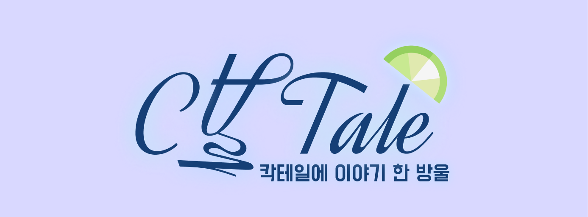
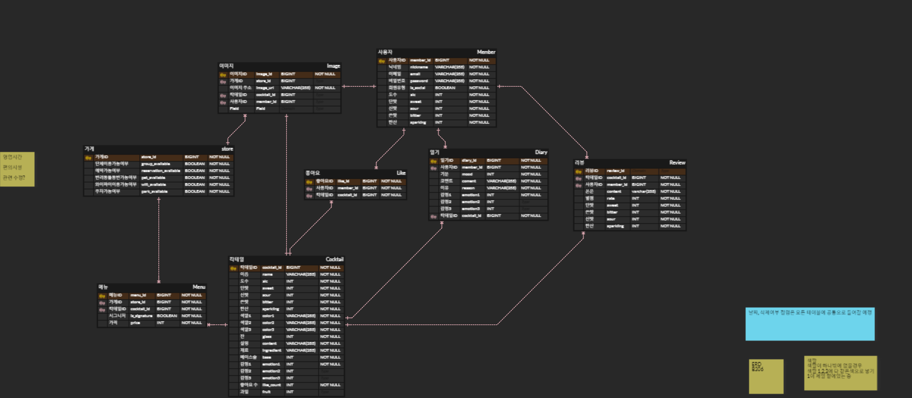
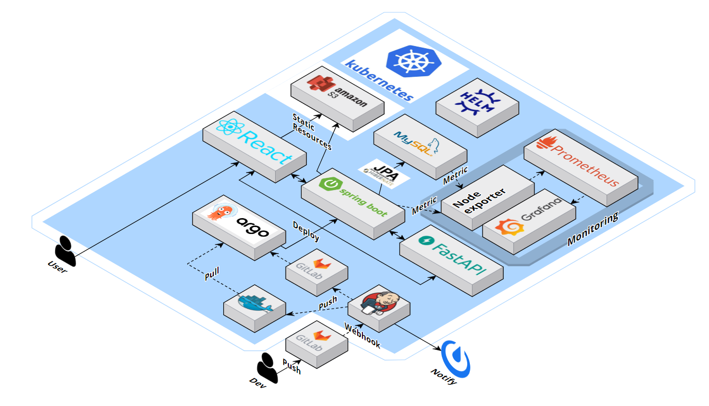

### 🏆삼성 청년 SW아카데미(SSAFY) 10th 특화 프로젝트 최우수상(1위)🏆

<h4> 나의 기분과 취향에 맞는 오늘의 칵테일 추천 서비스 </h4>

## ✅ 프로젝트 진행 기간

### 2024.02.19 ~ 2024.04.05(6주)

## **✅ 프로젝트 소개**

**🚩 서비스 한줄 소개**

`칵테일 추천 서비스
"고양이 바텐더와 대화를 통해 매일 자신의 기분에 따른 칵테일을 추천받고, 취향에 맞는 칵테일을 찾을 수 있는 추천 서비스 'Catale'"`

**🚩 기획 배경**

- 최근 스타벅스, 투썸플레이스와 같은 시중 카페에도 칵테일 판매를 시작하는 것 등을 통해 사람들의 칵테일에 대한 관심도가 높아졌다는 것을 알 수 있습니다.
- 칵테일 바에 방문했을 때, 각 칵테일의 맛과 향, 재료, 도수 등을 메뉴판만 보고 알기 어렵다는 단점이 있었습니다.
- 칵테일에 대해 알아볼 수 있는 기존의 방식은 검색 또는 바텐더와의 대화였고, 이를 합친 새로운 서비스가 있으면 좋겠다고 생각했습니다.

**🚩 기술 스택**
|  | skills |
| --- | --- |
| Backend |      |
| Frontend |   |
| Infra |         |
| 모니터링 툴 |   |
| 협업 툴 |     |
| 디자인 |  |

## **✅ 프로젝트 설명 및 특장점**

- 지정된 감정색과 칵테일 색을 바탕으로 사용자의 오늘의 감정과 원하는 도수에 맞는 칵테일을 추천할 수 있습니다.
- 오늘의 칵테일을 확인하면 추천 받은 칵테일과 오늘의 일기를 볼 수 있고 추천 받은 칵테일과 비슷한 칵테일 리스트를 볼 수 있습니다.
- 각 칵테일은 칵테일의 맛, 도수, 설명 등의 상세 정보와 해당 칵테일의 리뷰를 남길 수 있습니다.
- 지도 탭에서 유성구에  있는 칵테일 바의 정보를 파악할 수 있으며 해당 칵테일 바에서 판매하는 칵테일 매뉴를 도수에 따라 확인할 수 있습니다.
- 검색탭에서 키워드 검색을 통해 원하는 칵테일을 찾거나 옵션 검색을 통해 설정한 옵션에 해당하는 칵테일을 찾을 수 있습니다.

**🚩 프로젝트 확장성**

Catale을 더욱 개선된 서비스로 발전시키기 위해 세 가지 확장성 또한 고려할 수 있습니다.

- 모델 학습 로직 개선
    - 기존 사용자 이외 신규 사용자를 반영한 재학습 로직 추가 구현
- 서비스 지역 확대
    - 대전 외 지역의 칵테일 바 정보 업데이트
- 제휴 가맹점 확보
    - 칵테일 바와의 제휴를 통한 사용자 혜택 제공

## ✅ 프로젝트 구조

Backend

    📦src
    ┣ 📂main
    ┃ ┣ 📂java
    ┃ ┃ ┗ 📂com
    ┃ ┃ ┃ ┗ 📂catale
    ┃ ┃ ┃ ┃ ┗ 📂backend
    ┃ ┃ ┃ ┃ ┃ ┣ 📂domain
    ┃ ┃ ┃ ┃ ┃ ┃ ┣ 📂base
    ┃ ┃ ┃ ┃ ┃ ┃ ┃ ┗ 📜BaseEntity.java
    ┃ ┃ ┃ ┃ ┃ ┃ ┣ 📂cocktail
    ┃ ┃ ┃ ┃ ┃ ┃ ┃ ┣ 📂controller
    ┃ ┃ ┃ ┃ ┃ ┃ ┃ ┃ ┗ 📜CocktailController.java
    ┃ ┃ ┃ ┃ ┃ ┃ ┃ ┣ 📂dto
    ┃ ┃ ┃ ┃ ┃ ┃ ┃ ┃ ┣ 📜CocktailGetLikeResponseDto.java
    ┃ ┃ ┃ ┃ ┃ ┃ ┃ ┃ ┣ 📜CocktailGetResponseDto.java
    ┃ ┃ ┃ ┃ ┃ ┃ ┃ ┃ ┣ 📜CocktailLikeListRequestDto.java
    ┃ ┃ ┃ ┃ ┃ ┃ ┃ ┃ ┣ 📜CocktailLikeResponseDto.java
    ┃ ┃ ┃ ┃ ┃ ┃ ┃ ┃ ┣ 📜CocktailListResponseDto.java
    ┃ ┃ ┃ ┃ ┃ ┃ ┃ ┃ ┣ 📜CocktailSimpleInfoDto.java
    ┃ ┃ ┃ ┃ ┃ ┃ ┃ ┃ ┣ 📜CoctailMyreviewResponseDto.java
    ┃ ┃ ┃ ┃ ┃ ┃ ┃ ┃ ┣ 📜GetMemberRecommendDto.java
    ┃ ┃ ┃ ┃ ┃ ┃ ┃ ┃ ┣ 📜PreferenceDto.java
    ┃ ┃ ┃ ┃ ┃ ┃ ┃ ┃ ┣ 📜TodayCocktailRequestDto.java
    ┃ ┃ ┃ ┃ ┃ ┃ ┃ ┃ ┗ 📜TodayCocktailResponseDto.java
    ┃ ┃ ┃ ┃ ┃ ┃ ┃ ┣ 📂entity
    ┃ ┃ ┃ ┃ ┃ ┃ ┃ ┃ ┗ 📜Cocktail.java
    ┃ ┃ ┃ ┃ ┃ ┃ ┃ ┣ 📂repository
    ┃ ┃ ┃ ┃ ┃ ┃ ┃ ┃ ┣ 📂custom
    ┃ ┃ ┃ ┃ ┃ ┃ ┃ ┃ ┃ ┣ 📜CocktailRepositoryCustom.java
    ┃ ┃ ┃ ┃ ┃ ┃ ┃ ┃ ┃ ┗ 📜CocktailRepositoryImpl.java
    ┃ ┃ ┃ ┃ ┃ ┃ ┃ ┃ ┗ 📜CocktailRepository.java
    ┃ ┃ ┃ ┃ ┃ ┃ ┃ ┗ 📂service
    ┃ ┃ ┃ ┃ ┃ ┃ ┃ ┃ ┣ 📜CocktailService.java
    ┃ ┃ ┃ ┃ ┃ ┃ ┃ ┃ ┗ 📜RecommendApiService.java
    ┃ ┃ ┃ ┃ ┃ ┃ ┣ 📂diary
    ┃ ┃ ┃ ┃ ┃ ┃ ┃ ┣ 📂controller
    ┃ ┃ ┃ ┃ ┃ ┃ ┃ ┃ ┗ 📜DiaryController.java
    ┃ ┃ ┃ ┃ ┃ ┃ ┃ ┣ 📂dto
    ┃ ┃ ┃ ┃ ┃ ┃ ┃ ┃ ┣ 📜DiaryGetRequestDto.java
    ┃ ┃ ┃ ┃ ┃ ┃ ┃ ┃ ┣ 📜DiaryGetResponseDto.java
    ┃ ┃ ┃ ┃ ┃ ┃ ┃ ┃ ┣ 📜DiaryMonthResponseDto.java
    ┃ ┃ ┃ ┃ ┃ ┃ ┃ ┃ ┗ 📜MoodCntResponseDto.java
    ┃ ┃ ┃ ┃ ┃ ┃ ┃ ┣ 📂entity
    ┃ ┃ ┃ ┃ ┃ ┃ ┃ ┃ ┗ 📜Diary.java
    ┃ ┃ ┃ ┃ ┃ ┃ ┃ ┣ 📂repository
    ┃ ┃ ┃ ┃ ┃ ┃ ┃ ┃ ┣ 📂custom
    ┃ ┃ ┃ ┃ ┃ ┃ ┃ ┃ ┃ ┣ 📜DiaryRepositoryCustom.java
    ┃ ┃ ┃ ┃ ┃ ┃ ┃ ┃ ┃ ┗ 📜DiaryRepositoryImpl.java
    ┃ ┃ ┃ ┃ ┃ ┃ ┃ ┃ ┗ 📜DiaryRepository.java
    ┃ ┃ ┃ ┃ ┃ ┃ ┃ ┗ 📂service
    ┃ ┃ ┃ ┃ ┃ ┃ ┃ ┃ ┗ 📜DiaryService.java
    ┃ ┃ ┃ ┃ ┃ ┃ ┣ 📂image
    ┃ ┃ ┃ ┃ ┃ ┃ ┃ ┣ 📂controller
    ┃ ┃ ┃ ┃ ┃ ┃ ┃ ┃ ┗ 📜ImageController.java
    ┃ ┃ ┃ ┃ ┃ ┃ ┃ ┣ 📂dto
    ┃ ┃ ┃ ┃ ┃ ┃ ┃ ┃ ┗ 📜MemberImageUpdateRequestDto.java
    ┃ ┃ ┃ ┃ ┃ ┃ ┃ ┣ 📂entity
    ┃ ┃ ┃ ┃ ┃ ┃ ┃ ┃ ┗ 📜Image.java
    ┃ ┃ ┃ ┃ ┃ ┃ ┃ ┣ 📂repository
    ┃ ┃ ┃ ┃ ┃ ┃ ┃ ┃ ┣ 📂custom
    ┃ ┃ ┃ ┃ ┃ ┃ ┃ ┃ ┃ ┣ 📜ImageRepositoryCustom.java
    ┃ ┃ ┃ ┃ ┃ ┃ ┃ ┃ ┃ ┗ 📜ImageRepositoryImpl.java
    ┃ ┃ ┃ ┃ ┃ ┃ ┃ ┃ ┗ 📜ImageRepository.java
    ┃ ┃ ┃ ┃ ┃ ┃ ┃ ┗ 📂service
    ┃ ┃ ┃ ┃ ┃ ┃ ┃ ┃ ┗ 📜ImageService.java
    ┃ ┃ ┃ ┃ ┃ ┃ ┣ 📂like
    ┃ ┃ ┃ ┃ ┃ ┃ ┃ ┣ 📂dto
    ┃ ┃ ┃ ┃ ┃ ┃ ┃ ┃ ┗ 📜LikeResponseDto.java
    ┃ ┃ ┃ ┃ ┃ ┃ ┃ ┣ 📂entity
    ┃ ┃ ┃ ┃ ┃ ┃ ┃ ┃ ┗ 📜Like.java
    ┃ ┃ ┃ ┃ ┃ ┃ ┃ ┣ 📂repository
    ┃ ┃ ┃ ┃ ┃ ┃ ┃ ┃ ┣ 📂custom
    ┃ ┃ ┃ ┃ ┃ ┃ ┃ ┃ ┃ ┣ 📜LikeRepositoryCustom.java
    ┃ ┃ ┃ ┃ ┃ ┃ ┃ ┃ ┃ ┗ 📜LikeRepositoryImpl.java
    ┃ ┃ ┃ ┃ ┃ ┃ ┃ ┃ ┗ 📜LikeRepository.java
    ┃ ┃ ┃ ┃ ┃ ┃ ┃ ┗ 📂service
    ┃ ┃ ┃ ┃ ┃ ┃ ┃ ┃ ┗ 📜LikeService.java
    ┃ ┃ ┃ ┃ ┃ ┃ ┣ 📂member
    ┃ ┃ ┃ ┃ ┃ ┃ ┃ ┣ 📂controller
    ┃ ┃ ┃ ┃ ┃ ┃ ┃ ┃ ┗ 📜MemberController.java
    ┃ ┃ ┃ ┃ ┃ ┃ ┃ ┣ 📂dto
    ┃ ┃ ┃ ┃ ┃ ┃ ┃ ┃ ┣ 📜EmailValidationRequestDto.java
    ┃ ┃ ┃ ┃ ┃ ┃ ┃ ┃ ┣ 📜EmailValidationResponseDto.java
    ┃ ┃ ┃ ┃ ┃ ┃ ┃ ┃ ┣ 📜LoginRequestDto.java
    ┃ ┃ ┃ ┃ ┃ ┃ ┃ ┃ ┣ 📜LoginResponseDto.java
    ┃ ┃ ┃ ┃ ┃ ┃ ┃ ┃ ┣ 📜MemberInfo.java
    ┃ ┃ ┃ ┃ ┃ ┃ ┃ ┃ ┣ 📜MemberInfoDto.java
    ┃ ┃ ┃ ┃ ┃ ┃ ┃ ┃ ┣ 📜NicknameDoubleCheckRequestDto.java
    ┃ ┃ ┃ ┃ ┃ ┃ ┃ ┃ ┣ 📜NicknameRequestDto.java
    ┃ ┃ ┃ ┃ ┃ ┃ ┃ ┃ ┣ 📜PasswordRequestDto.java
    ┃ ┃ ┃ ┃ ┃ ┃ ┃ ┃ ┣ 📜PasswordValidationRequestDto.java
    ┃ ┃ ┃ ┃ ┃ ┃ ┃ ┃ ┣ 📜PostPreferenceRequestDto.java
    ┃ ┃ ┃ ┃ ┃ ┃ ┃ ┃ ┗ 📜SignupRequestDto.java
    ┃ ┃ ┃ ┃ ┃ ┃ ┃ ┣ 📂entity
    ┃ ┃ ┃ ┃ ┃ ┃ ┃ ┃ ┗ 📜Member.java
    ┃ ┃ ┃ ┃ ┃ ┃ ┃ ┣ 📂repository
    ┃ ┃ ┃ ┃ ┃ ┃ ┃ ┃ ┣ 📂custom
    ┃ ┃ ┃ ┃ ┃ ┃ ┃ ┃ ┃ ┣ 📜MemberRepositoryCustom.java
    ┃ ┃ ┃ ┃ ┃ ┃ ┃ ┃ ┃ ┗ 📜MemberRepositoryImpl.java
    ┃ ┃ ┃ ┃ ┃ ┃ ┃ ┃ ┗ 📜MemberRepository.java
    ┃ ┃ ┃ ┃ ┃ ┃ ┃ ┗ 📂service
    ┃ ┃ ┃ ┃ ┃ ┃ ┃ ┃ ┗ 📜MemberService.java
    ┃ ┃ ┃ ┃ ┃ ┃ ┣ 📂menu
    ┃ ┃ ┃ ┃ ┃ ┃ ┃ ┣ 📂dto
    ┃ ┃ ┃ ┃ ┃ ┃ ┃ ┃ ┗ 📜MenuGetResponseDto.java
    ┃ ┃ ┃ ┃ ┃ ┃ ┃ ┣ 📂entity
    ┃ ┃ ┃ ┃ ┃ ┃ ┃ ┃ ┗ 📜Menu.java
    ┃ ┃ ┃ ┃ ┃ ┃ ┃ ┗ 📂repository
    ┃ ┃ ┃ ┃ ┃ ┃ ┃ ┃ ┣ 📂custom
    ┃ ┃ ┃ ┃ ┃ ┃ ┃ ┃ ┃ ┣ 📜MenuRepositoryCustom.java
    ┃ ┃ ┃ ┃ ┃ ┃ ┃ ┃ ┃ ┗ 📜MenuRepositoryImpl.java
    ┃ ┃ ┃ ┃ ┃ ┃ ┃ ┃ ┗ 📜MenuRepository.java
    ┃ ┃ ┃ ┃ ┃ ┃ ┣ 📂review
    ┃ ┃ ┃ ┃ ┃ ┃ ┃ ┣ 📂controller
    ┃ ┃ ┃ ┃ ┃ ┃ ┃ ┃ ┗ 📜ReviewController.java
    ┃ ┃ ┃ ┃ ┃ ┃ ┃ ┣ 📂dto
    ┃ ┃ ┃ ┃ ┃ ┃ ┃ ┃ ┣ 📜ReviewGetRequestDto.java
    ┃ ┃ ┃ ┃ ┃ ┃ ┃ ┃ ┣ 📜ReviewGetResponseDto.java
    ┃ ┃ ┃ ┃ ┃ ┃ ┃ ┃ ┗ 📜ReviewListResponseDto.java
    ┃ ┃ ┃ ┃ ┃ ┃ ┃ ┣ 📂entity
    ┃ ┃ ┃ ┃ ┃ ┃ ┃ ┃ ┗ 📜Review.java
    ┃ ┃ ┃ ┃ ┃ ┃ ┃ ┣ 📂repository
    ┃ ┃ ┃ ┃ ┃ ┃ ┃ ┃ ┣ 📂custom
    ┃ ┃ ┃ ┃ ┃ ┃ ┃ ┃ ┃ ┣ 📜ReviewRepositoryCustom.java
    ┃ ┃ ┃ ┃ ┃ ┃ ┃ ┃ ┃ ┗ 📜ReviewRepositoryImpl.java
    ┃ ┃ ┃ ┃ ┃ ┃ ┃ ┃ ┗ 📜ReviewRepository.java
    ┃ ┃ ┃ ┃ ┃ ┃ ┃ ┗ 📂service
    ┃ ┃ ┃ ┃ ┃ ┃ ┃ ┃ ┗ 📜ReviewService.java
    ┃ ┃ ┃ ┃ ┃ ┃ ┗ 📂store
    ┃ ┃ ┃ ┃ ┃ ┃ ┃ ┣ 📂controller
    ┃ ┃ ┃ ┃ ┃ ┃ ┃ ┃ ┗ 📜StoreController.java
    ┃ ┃ ┃ ┃ ┃ ┃ ┃ ┣ 📂dto
    ┃ ┃ ┃ ┃ ┃ ┃ ┃ ┃ ┗ 📜StoreGetResponseDto.java
    ┃ ┃ ┃ ┃ ┃ ┃ ┃ ┣ 📂entity
    ┃ ┃ ┃ ┃ ┃ ┃ ┃ ┃ ┗ 📜Store.java
    ┃ ┃ ┃ ┃ ┃ ┃ ┃ ┣ 📂repository
    ┃ ┃ ┃ ┃ ┃ ┃ ┃ ┃ ┗ 📜StoreRepository.java
    ┃ ┃ ┃ ┃ ┃ ┃ ┃ ┗ 📂service
    ┃ ┃ ┃ ┃ ┃ ┃ ┃ ┃ ┗ 📜StoreService.java
    ┃ ┃ ┃ ┃ ┃ ┣ 📂global
    ┃ ┃ ┃ ┃ ┃ ┃ ┣ 📂annotation
    ┃ ┃ ┃ ┃ ┃ ┃ ┃ ┣ 📜AccessToken.java
    ┃ ┃ ┃ ┃ ┃ ┃ ┃ ┗ 📜Nickname.java
    ┃ ┃ ┃ ┃ ┃ ┃ ┣ 📂config
    ┃ ┃ ┃ ┃ ┃ ┃ ┃ ┣ 📜MailConfig.java
    ┃ ┃ ┃ ┃ ┃ ┃ ┃ ┣ 📜QuerydslConfig.java
    ┃ ┃ ┃ ┃ ┃ ┃ ┃ ┣ 📜RedisConfig.java
    ┃ ┃ ┃ ┃ ┃ ┃ ┃ ┣ 📜S3Config.java
    ┃ ┃ ┃ ┃ ┃ ┃ ┃ ┣ 📜SecurityConfig.java
    ┃ ┃ ┃ ┃ ┃ ┃ ┃ ┣ 📜SwaggerConfig.java
    ┃ ┃ ┃ ┃ ┃ ┃ ┃ ┗ 📜WebConfig.java
    ┃ ┃ ┃ ┃ ┃ ┃ ┣ 📂entrypoint
    ┃ ┃ ┃ ┃ ┃ ┃ ┃ ┗ 📜JwtAuthenticationEntryPoint.java
    ┃ ┃ ┃ ┃ ┃ ┃ ┣ 📂exception
    ┃ ┃ ┃ ┃ ┃ ┃ ┃ ┣ 📂cocktail
    ┃ ┃ ┃ ┃ ┃ ┃ ┃ ┃ ┗ 📜CocktailNotFoundException.java
    ┃ ┃ ┃ ┃ ┃ ┃ ┃ ┣ 📂diary
    ┃ ┃ ┃ ┃ ┃ ┃ ┃ ┃ ┣ 📜DiaryCreateException.java
    ┃ ┃ ┃ ┃ ┃ ┃ ┃ ┃ ┣ 📜DiaryDeleteException.java
    ┃ ┃ ┃ ┃ ┃ ┃ ┃ ┃ ┗ 📜DiaryNotFoundException.java
    ┃ ┃ ┃ ┃ ┃ ┃ ┃ ┣ 📂email
    ┃ ┃ ┃ ┃ ┃ ┃ ┃ ┃ ┣ 📜FailedMessageTransmissionException.java
    ┃ ┃ ┃ ┃ ┃ ┃ ┃ ┃ ┗ 📜InvalidAuthCodeException.java
    ┃ ┃ ┃ ┃ ┃ ┃ ┃ ┣ 📂image
    ┃ ┃ ┃ ┃ ┃ ┃ ┃ ┃ ┣ 📜FileTypeIncorrectException.java
    ┃ ┃ ┃ ┃ ┃ ┃ ┃ ┃ ┣ 📜ImageFileNotFoundException.java
    ┃ ┃ ┃ ┃ ┃ ┃ ┃ ┃ ┣ 📜ImageNotFoundException.java
    ┃ ┃ ┃ ┃ ┃ ┃ ┃ ┃ ┣ 📜ImageRegisterException.java
    ┃ ┃ ┃ ┃ ┃ ┃ ┃ ┃ ┗ 📜ImageUpdateException.java
    ┃ ┃ ┃ ┃ ┃ ┃ ┃ ┣ 📂jwt
    ┃ ┃ ┃ ┃ ┃ ┃ ┃ ┃ ┣ 📜AccessTokenNotFoundException.java
    ┃ ┃ ┃ ┃ ┃ ┃ ┃ ┃ ┣ 📜RefreshTokenNotFoundException.java
    ┃ ┃ ┃ ┃ ┃ ┃ ┃ ┃ ┗ 📜UnauthorizedAccessException.java
    ┃ ┃ ┃ ┃ ┃ ┃ ┃ ┣ 📂member
    ┃ ┃ ┃ ┃ ┃ ┃ ┃ ┃ ┣ 📜DuplicateEmailException.java
    ┃ ┃ ┃ ┃ ┃ ┃ ┃ ┃ ┣ 📜DuplicateNicknameException.java
    ┃ ┃ ┃ ┃ ┃ ┃ ┃ ┃ ┣ 📜EmailNotFoundException.java
    ┃ ┃ ┃ ┃ ┃ ┃ ┃ ┃ ┣ 📜InvalidLoginAttemptException.java
    ┃ ┃ ┃ ┃ ┃ ┃ ┃ ┃ ┣ 📜InvalidNicknameException.java
    ┃ ┃ ┃ ┃ ┃ ┃ ┃ ┃ ┣ 📜InvalidPasswordException.java
    ┃ ┃ ┃ ┃ ┃ ┃ ┃ ┃ ┣ 📜MemberNotFoundException.java
    ┃ ┃ ┃ ┃ ┃ ┃ ┃ ┃ ┣ 📜MissingPathVariableException.java
    ┃ ┃ ┃ ┃ ┃ ┃ ┃ ┃ ┣ 📜PasswordMismatchException.java
    ┃ ┃ ┃ ┃ ┃ ┃ ┃ ┃ ┗ 📜ProfileUpdateException.java
    ┃ ┃ ┃ ┃ ┃ ┃ ┃ ┗ 📂review
    ┃ ┃ ┃ ┃ ┃ ┃ ┃ ┃ ┣ 📜ReviewCreateException.java
    ┃ ┃ ┃ ┃ ┃ ┃ ┃ ┃ ┣ 📜ReviewDeleteException.java
    ┃ ┃ ┃ ┃ ┃ ┃ ┃ ┃ ┣ 📜ReviewListNotFoundException.java
    ┃ ┃ ┃ ┃ ┃ ┃ ┃ ┃ ┗ 📜ReviewNotFoundException.java
    ┃ ┃ ┃ ┃ ┃ ┃ ┣ 📂filter
    ┃ ┃ ┃ ┃ ┃ ┃ ┃ ┣ 📜EmailVerificationFilter.java
    ┃ ┃ ┃ ┃ ┃ ┃ ┃ ┣ 📜JwtAuthenticationFilter.java
    ┃ ┃ ┃ ┃ ┃ ┃ ┃ ┣ 📜TokenExceptionFilter.java
    ┃ ┃ ┃ ┃ ┃ ┃ ┃ ┗ 📜TokenRefreshRequestFilter.java
    ┃ ┃ ┃ ┃ ┃ ┃ ┣ 📂format
    ┃ ┃ ┃ ┃ ┃ ┃ ┃ ┣ 📂code
    ┃ ┃ ┃ ┃ ┃ ┃ ┃ ┃ ┣ 📜ApiResponse.java
    ┃ ┃ ┃ ┃ ┃ ┃ ┃ ┃ ┗ 📜FilterResponse.java
    ┃ ┃ ┃ ┃ ┃ ┃ ┃ ┗ 📂response
    ┃ ┃ ┃ ┃ ┃ ┃ ┃ ┃ ┣ 📜ErrorCode.java
    ┃ ┃ ┃ ┃ ┃ ┃ ┃ ┃ ┗ 📜ResponseCode.java
    ┃ ┃ ┃ ┃ ┃ ┃ ┣ 📂handler
    ┃ ┃ ┃ ┃ ┃ ┃ ┃ ┗ 📜GlobalExceptionHandler.java
    ┃ ┃ ┃ ┃ ┃ ┃ ┣ 📂initializer
    ┃ ┃ ┃ ┃ ┃ ┃ ┃ ┗ 📜RedisInitializer.java
    ┃ ┃ ┃ ┃ ┃ ┃ ┣ 📂interceptor
    ┃ ┃ ┃ ┃ ┃ ┃ ┃ ┗ 📜NicknameValidInterceptor.java
    ┃ ┃ ┃ ┃ ┃ ┃ ┣ 📂jwt
    ┃ ┃ ┃ ┃ ┃ ┃ ┃ ┣ 📂provider
    ┃ ┃ ┃ ┃ ┃ ┃ ┃ ┃ ┗ 📜TokenProvider.java
    ┃ ┃ ┃ ┃ ┃ ┃ ┃ ┣ 📂repository
    ┃ ┃ ┃ ┃ ┃ ┃ ┃ ┃ ┗ 📜RefreshTokenRepository.java
    ┃ ┃ ┃ ┃ ┃ ┃ ┃ ┣ 📂service
    ┃ ┃ ┃ ┃ ┃ ┃ ┃ ┃ ┗ 📜TokenService.java
    ┃ ┃ ┃ ┃ ┃ ┃ ┃ ┣ 📜RefreshToken.java
    ┃ ┃ ┃ ┃ ┃ ┃ ┃ ┗ 📜TokenInfo.java
    ┃ ┃ ┃ ┃ ┃ ┃ ┣ 📂resolver
    ┃ ┃ ┃ ┃ ┃ ┃ ┃ ┣ 📜AccessTokenArgumentResolver.java
    ┃ ┃ ┃ ┃ ┃ ┃ ┃ ┗ 📜NicknameValidArgumentResolver.java
    ┃ ┃ ┃ ┃ ┃ ┃ ┗ 📂util
    ┃ ┃ ┃ ┃ ┃ ┃ ┃ ┣ 📂cookie
    ┃ ┃ ┃ ┃ ┃ ┃ ┃ ┃ ┣ 📜DevCookieUtil.java
    ┃ ┃ ┃ ┃ ┃ ┃ ┃ ┃ ┗ 📜ProdCookieUtil.java
    ┃ ┃ ┃ ┃ ┃ ┃ ┃ ┣ 📜CookieUtil.java
    ┃ ┃ ┃ ┃ ┃ ┃ ┃ ┣ 📜FilterUtil.java
    ┃ ┃ ┃ ┃ ┃ ┃ ┃ ┗ 📜RedisUtil.java
    ┃ ┃ ┃ ┃ ┃ ┗ 📜BackendApplication.java
    ┃ ┗ 📂resources
    ┃ ┃ ┗ 📜application.yml
    ┗ 📂test
    ┃ ┗ 📂java
    ┃ ┃ ┗ 📂com
    ┃ ┃ ┃ ┗ 📂catale
    ┃ ┃ ┃ ┃ ┗ 📂backend
    ┃ ┃ ┃ ┃ ┃ ┗ 📜BackendApplicationTests.java

Frontend

    📦src
    ┣ 📂api
    ┃ ┣ 📂common
    ┃ ┃ ┗ 📜Token.jsx
    ┃ ┣ 📜Cocktail.jsx
    ┃ ┣ 📜Diary.jsx
    ┃ ┣ 📜Image.jsx
    ┃ ┣ 📜Member.jsx
    ┃ ┣ 📜Review.jsx
    ┃ ┗ 📜Store.jsx
    ┣ 📂assets
    ┃ ┣ 📂bartender
    ┃ ┃ ┣ 📜cocktail.png
    ┃ ┃ ┣ 📜emo1.png
    ┃ ┃ ┣ 📜emo2.png
    ┃ ┃ ┣ 📜emo3.png
    ┃ ┃ ┣ 📜emo4.png
    ┃ ┃ ┣ 📜emo5.png
    ┃ ┃ ┣ 📜emobox.png
    ┃ ┃ ┣ 📜고양이말풍선.png
    ┃ ┃ ┣ 📜꼬질냥.gif
    ┃ ┃ ┣ 📜연필.png
    ┃ ┃ ┣ 📜오늘의칵테일1.png
    ┃ ┃ ┣ 📜유저말풍선.png
    ┃ ┃ ┣ 📜자산8.png
    ┃ ┃ ┣ 📜종이비행기.png
    ┃ ┃ ┗ 📜파란말풍선.png
    ┃ ┣ 📂common
    ┃ ┃ ┣ 📜arrow1.png
    ┃ ┃ ┣ 📜arrow2.png
    ┃ ┃ ┣ 📜arrow3.png
    ┃ ┃ ┣ 📜arrow4.png
    ┃ ┃ ┣ 📜arrow5.png
    ┃ ┃ ┣ 📜card.png
    ┃ ┃ ┣ 📜check.png
    ┃ ┃ ┣ 📜close.png
    ┃ ┃ ┣ 📜diary.png
    ┃ ┃ ┣ 📜edit.png
    ┃ ┃ ┣ 📜like.png
    ┃ ┃ ┣ 📜logout.png
    ┃ ┃ ┣ 📜minus1.png
    ┃ ┃ ┣ 📜minus2.png
    ┃ ┃ ┣ 📜noneLike.png
    ┃ ┃ ┣ 📜noneStar.png
    ┃ ┃ ┣ 📜pentagon.png
    ┃ ┃ ┣ 📜plus1.png
    ┃ ┃ ┣ 📜plus2.png
    ┃ ┃ ┣ 📜profile.png
    ┃ ┃ ┣ 📜review.png
    ┃ ┃ ┣ 📜setting.png
    ┃ ┃ ┣ 📜star.png
    ┃ ┃ ┣ 📜store1.png
    ┃ ┃ ┣ 📜store2.png
    ┃ ┃ ┣ 📜store3.png
    ┃ ┃ ┣ 📜store4.png
    ┃ ┃ ┣ 📜store5.png
    ┃ ┃ ┣ 📜trash.png
    ┃ ┃ ┗ 📜웰컴.png
    ┃ ┣ 📂glass
    ┃ ┃ ┣ 📜glass1.png
    ┃ ┃ ┣ 📜glass2.png
    ┃ ┃ ┣ 📜glass3.png
    ┃ ┃ ┣ 📜glass4.png
    ┃ ┃ ┣ 📜glass5.png
    ┃ ┃ ┣ 📜glass6.png
    ┃ ┃ ┗ 📜glass7.png
    ┃ ┣ 📂guide
    ┃ ┃ ┣ 📜가이드1.jpg
    ┃ ┃ ┣ 📜가이드2.jpg
    ┃ ┃ ┣ 📜가이드3.jpg
    ┃ ┃ ┣ 📜가이드4.jpg
    ┃ ┃ ┣ 📜가이드5.jpg
    ┃ ┃ ┣ 📜가이드6.jpg
    ┃ ┃ ┗ 📜가이드7.jpg
    ┃ ┣ 📂icon
    ┃ ┃ ┣ 📜calA.png
    ┃ ┃ ┣ 📜calB.png
    ┃ ┃ ┣ 📜Clickno.png
    ┃ ┃ ┣ 📜Clickyes.png
    ┃ ┃ ┣ 📜homeA.png
    ┃ ┃ ┣ 📜homeB.png
    ┃ ┃ ┣ 📜IconInsta.png
    ┃ ┃ ┣ 📜IconMap.png
    ┃ ┃ ┣ 📜IconTel.png
    ┃ ┃ ┣ 📜IconTime.png
    ┃ ┃ ┣ 📜mapA.png
    ┃ ┃ ┣ 📜mapB.png
    ┃ ┃ ┣ 📜searchA.png
    ┃ ┃ ┣ 📜searchB.png
    ┃ ┃ ┣ 📜userA.png
    ┃ ┃ ┣ 📜userB.png
    ┃ ┃ ┣ 📜검색돋보기.png
    ┃ ┃ ┣ 📜동색.png
    ┃ ┃ ┣ 📜왕관.png
    ┃ ┃ ┣ 📜은색.png
    ┃ ┃ ┣ 📜이퀄라이저.png
    ┃ ┃ ┗ 📜체크이미지.png
    ┃ ┣ 📂lottie
    ┃ ┃ ┣ 📜Cocktail1.json
    ┃ ┃ ┗ 📜Cocktail2.json
    ┃ ┗ 📂store
    ┃ ┃ ┣ 📜럭키바.jpg
    ┃ ┃ ┣ 📜리케리케라운지.jpg
    ┃ ┃ ┗ 📜사막의하얀꽃.jpg
    ┣ 📂components
    ┃ ┣ 📂common
    ┃ ┃ ┣ 📜Box.jsx
    ┃ ┃ ┣ 📜Box.module.css
    ┃ ┃ ┣ 📜Container.jsx
    ┃ ┃ ┣ 📜Container.module.css
    ┃ ┃ ┣ 📜ContainerMain.jsx
    ┃ ┃ ┣ 📜ContainerMain.module.css
    ┃ ┃ ┣ 📜FileInput.css
    ┃ ┃ ┣ 📜FileInput.jsx
    ┃ ┃ ┣ 📜Header.jsx
    ┃ ┃ ┣ 📜Header.module.css
    ┃ ┃ ┣ 📜HeaderResult.jsx
    ┃ ┃ ┣ 📜Headerwb.jsx
    ┃ ┃ ┣ 📜Headerwb.module.css
    ┃ ┃ ┣ 📜Nav.jsx
    ┃ ┃ ┣ 📜Nav.module.css
    ┃ ┃ ┣ 📜Popup.jsx
    ┃ ┃ ┣ 📜Popup.module.css
    ┃ ┃ ┗ 📜ScrollToTop.jsx
    ┃ ┣ 📂data
    ┃ ┃ ┣ 📜base.jsx
    ┃ ┃ ┗ 📜searchtalk.jsx
    ┃ ┣ 📂diary
    ┃ ┃ ┣ 📜CocktailDetail.jsx
    ┃ ┃ ┗ 📜CocktailDetail.module.css
    ┃ ┣ 📂main
    ┃ ┃ ┣ 📜Cattalk11.jsx
    ┃ ┃ ┣ 📜Cattalk20.jsx
    ┃ ┃ ┣ 📜Cattalkbox.jsx
    ┃ ┃ ┣ 📜Cattalkbox.module.css
    ┃ ┃ ┣ 📜CocktailBox.jsx
    ┃ ┃ ┣ 📜CocktailBox.module.css
    ┃ ┃ ┣ 📜CocktailBox2.jsx
    ┃ ┃ ┣ 📜CocktailBox3.jsx
    ┃ ┃ ┣ 📜CocktailBox3.module.css
    ┃ ┃ ┣ 📜CocktailBoxBig.jsx
    ┃ ┃ ┣ 📜CocktailBoxBig.module.css
    ┃ ┃ ┣ 📜Cocktailsearchbox.jsx
    ┃ ┃ ┣ 📜Todaycocktail.jsx
    ┃ ┃ ┣ 📜Todaycocktail.module.css
    ┃ ┃ ┣ 📜Usercomment.jsx
    ┃ ┃ ┣ 📜Usercomment.module.css
    ┃ ┃ ┣ 📜Useremothree.jsx
    ┃ ┃ ┣ 📜Useremothree.module.css
    ┃ ┃ ┣ 📜Userreasonbox.jsx
    ┃ ┃ ┣ 📜Userreasonbox.module.css
    ┃ ┃ ┣ 📜Userselctbox.jsx
    ┃ ┃ ┣ 📜Userselctbox.module.css
    ┃ ┃ ┣ 📜Usertalkbox.jsx
    ┃ ┃ ┣ 📜Usertalkbox.module.css
    ┃ ┃ ┣ 📜Usertodayemo.jsx
    ┃ ┃ ┗ 📜Usertodayemo.module.css
    ┃ ┣ 📂map
    ┃ ┃ ┣ 📂data
    ┃ ┃ ┃ ┗ 📜markerData.jsx
    ┃ ┃ ┣ 📜map.jsx
    ┃ ┃ ┣ 📜map.module.css
    ┃ ┃ ┣ 📜Storebos.module.css
    ┃ ┃ ┣ 📜Storebox.jsx
    ┃ ┃ ┣ 📜StoreInfo.jsx
    ┃ ┃ ┣ 📜StoreInfo.module.css
    ┃ ┃ ┣ 📜Storemenu.jsx
    ┃ ┃ ┣ 📜Storemenu.module.css
    ┃ ┃ ┣ 📜Storepicture.jsx
    ┃ ┃ ┗ 📜Storepicture.module.css
    ┃ ┣ 📂my
    ┃ ┃ ┣ 📜MyFeel.jsx
    ┃ ┃ ┣ 📜MyFeel.module.css
    ┃ ┃ ┣ 📜ReviewItem.jsx
    ┃ ┃ ┗ 📜ReviewItem.module.css
    ┃ ┣ 📂review
    ┃ ┃ ┣ 📜Review.jsx
    ┃ ┃ ┗ 📜Review.module.css
    ┃ ┗ 📂search
    ┃ ┃ ┣ 📜Medallist.jsx
    ┃ ┃ ┣ 📜Medallist.module.css
    ┃ ┃ ┣ 📜Nonmedallist.jsx
    ┃ ┃ ┣ 📜Nonmedallist.module.css
    ┃ ┃ ┣ 📜Searchbase.jsx
    ┃ ┃ ┣ 📜Searchbase.module.css
    ┃ ┃ ┣ 📜Searchoption.jsx
    ┃ ┃ ┗ 📜Searchoption.module.css
    ┣ 📂pages
    ┃ ┣ 📂cocktailpage
    ┃ ┃ ┣ 📜CocktailDetailPage.jsx
    ┃ ┃ ┣ 📜CocktailDetailPage.module.css
    ┃ ┃ ┣ 📜CocktailReviewPage.jsx
    ┃ ┃ ┗ 📜CocktailReviewPage.module.css
    ┃ ┣ 📂commonpage
    ┃ ┃ ┣ 📜ErrorPage.jsx
    ┃ ┃ ┗ 📜ErrorPage.module.css
    ┃ ┣ 📂diarypage
    ┃ ┃ ┣ 📜DatePage.jsx
    ┃ ┃ ┣ 📜DatePage.module.css
    ┃ ┃ ┣ 📜DiaryPage.jsx
    ┃ ┃ ┗ 📜DiaryPage.module.css
    ┃ ┣ 📂mainpage
    ┃ ┃ ┣ 📂Emodata
    ┃ ┃ ┃ ┣ 📜Emocolor.jsx
    ┃ ┃ ┃ ┣ 📜Emotionthree.jsx
    ┃ ┃ ┃ ┗ 📜Reasonone.jsx
    ┃ ┃ ┣ 📂Talkdata
    ┃ ┃ ┃ ┣ 📜Cattalk.jsx
    ┃ ┃ ┃ ┣ 📜Selecttalk.jsx
    ┃ ┃ ┃ ┣ 📜Talkarr.jsx
    ┃ ┃ ┃ ┗ 📜Usertalk.jsx
    ┃ ┃ ┣ 📜MainPage.jsx
    ┃ ┃ ┣ 📜MainPage.module.css
    ┃ ┃ ┣ 📜ResultPage.jsx
    ┃ ┃ ┗ 📜ResultPage.module.css
    ┃ ┣ 📂mappage
    ┃ ┃ ┣ 📜MapPage.jsx
    ┃ ┃ ┣ 📜MapPage.module.css
    ┃ ┃ ┣ 📜StoreDetailPage.jsx
    ┃ ┃ ┗ 📜StoreDetailPage.module.css
    ┃ ┣ 📂mypage
    ┃ ┃ ┣ 📜ChangePreferencePage.jsx
    ┃ ┃ ┣ 📜ChangePreferencePage.module.css
    ┃ ┃ ┣ 📜LikedCocktailPage.jsx
    ┃ ┃ ┣ 📜LikedCocktailPage.module.css
    ┃ ┃ ┣ 📜MonthlyMoodPage.jsx
    ┃ ┃ ┣ 📜MonthlyMoodPage.module.css
    ┃ ┃ ┣ 📜MyCocktailPage.jsx
    ┃ ┃ ┣ 📜MyCocktailPage.module.css
    ┃ ┃ ┣ 📜MyPage.jsx
    ┃ ┃ ┣ 📜MyPage.module.css
    ┃ ┃ ┣ 📜RecommendPage.jsx
    ┃ ┃ ┗ 📜RecommendPage.module.css
    ┃ ┣ 📂settingpage
    ┃ ┃ ┣ 📜DeleteAccountPage.jsx
    ┃ ┃ ┣ 📜DeleteAccountPage.module.css
    ┃ ┃ ┣ 📜SettingsPage.jsx
    ┃ ┃ ┗ 📜SettingsPage.module.css
    ┃ ┣ 📜Choosecocktail.jsx
    ┃ ┣ 📜Choosecocktail.module.css
    ┃ ┣ 📜GuidePage.jsx
    ┃ ┣ 📜GuidePage.module.css
    ┃ ┣ 📜PreferencePage.jsx
    ┃ ┣ 📜PreferencePage.module.css
    ┃ ┣ 📜SearchPage.jsx
    ┃ ┣ 📜SearchPage.module.css
    ┃ ┣ 📜SignInPage.jsx
    ┃ ┣ 📜SignInPage.module.css
    ┃ ┣ 📜SignUpPage.jsx
    ┃ ┣ 📜SignUpPage.module.css
    ┃ ┣ 📜WelcomePage.jsx
    ┃ ┗ 📜WelcomePage.module.css
    ┣ 📂store
    ┃ ┣ 📜useCocktailStore.jsx
    ┃ ┣ 📜useSearchStore.jsx
    ┃ ┗ 📜useUserStore.jsx
    ┣ 📜App.css
    ┣ 📜App.jsx
    ┣ 📜index.css
    ┣ 📜index.jsx
    ┣ 📜Main.jsx
    ┣ 📜service-worker.js
    ┗ 📜serviceWorkerRegistration.js

FastAPI

    📦recommend-server
    ┣ 📂.idea
    ┃ ┣ 📂inspectionProfiles
    ┃ ┃ ┗ 📜Project_Default.xml
    ┃ ┣ 📜.gitignore
    ┃ ┣ 📜misc.xml
    ┃ ┣ 📜modules.xml
    ┃ ┣ 📜recommend-server.iml
    ┃ ┗ 📜vcs.xml
    ┣ 📂app
    ┃ ┣ 📂common
    ┃ ┃ ┣ 📂context
    ┃ ┃ ┃ ┗ 📜ItemFeatures.py
    ┃ ┃ ┣ 📜config.py
    ┃ ┃ ┗ 📜__init__.py
    ┃ ┣ 📂models
    ┃ ┃ ┣ 📂dto
    ┃ ┃ ┃ ┣ 📜data_class.py
    ┃ ┃ ┃ ┗ 📜__init__.py
    ┃ ┃ ┣ 📂save
    ┃ ┃ ┃ ┣ 📜catale_dataset.pkl
    ┃ ┃ ┃ ┣ 📜cocktail - 복사본.csv
    ┃ ┃ ┃ ┣ 📜cocktail.csv
    ┃ ┃ ┃ ┣ 📜cocktail_features.csv
    ┃ ┃ ┃ ┣ 📜cocktail_index.csv
    ┃ ┃ ┃ ┣ 📜fdsfsd.txt
    ┃ ┃ ┃ ┣ 📜item_features - 복사본.csv
    ┃ ┃ ┃ ┣ 📜item_features.csv
    ┃ ┃ ┃ ┣ 📜rating.csv
    ┃ ┃ ┃ ┣ 📜test_ratings.csv
    ┃ ┃ ┃ ┣ 📜train_ratings.csv
    ┃ ┃ ┃ ┣ 📜user_features - 복사본.csv
    ┃ ┃ ┃ ┣ 📜user_features.csv
    ┃ ┃ ┃ ┣ 📜user_index.csv
    ┃ ┃ ┃ ┣ 📜user_preferences - 복사본.csv
    ┃ ┃ ┃ ┣ 📜user_preferences.csv
    ┃ ┃ ┃ ┗ 📜__init__.py
    ┃ ┃ ┣ 📜catale_dataset.pkl
    ┃ ┃ ┣ 📜catale_model.pkl
    ┃ ┃ ┗ 📜__init__.py
    ┃ ┣ 📂routers
    ┃ ┃ ┣ 📜recommend.py
    ┃ ┃ ┣ 📜retrain.py
    ┃ ┃ ┗ 📜__init__.py
    ┃ ┣ 📂service
    ┃ ┃ ┣ 📜recommend_service.py
    ┃ ┃ ┣ 📜retrain_service.py
    ┃ ┃ ┣ 📜sample_data_produce.py
    ┃ ┃ ┗ 📜__init__.py
    ┃ ┣ 📂util
    ┃ ┃ ┣ 📜modelutil.py
    ┃ ┃ ┣ 📜optimizer.py
    ┃ ┃ ┗ 📜__init__.py
    ┃ ┣ 📜crud.py
    ┃ ┣ 📜database.py
    ┃ ┣ 📜item_similarity.py
    ┃ ┣ 📜main.py
    ┃ ┣ 📜schemas.py
    ┃ ┗ 📜__init__.py
    ┣ 📂model
    ┃ ┣ 📂v1
    ┃ ┃ ┗ 📜user_rating_model_v1.pkl
    ┃ ┗ 📜user_rating_model_v1.pkl
    ┣ 📂out
    ┃ ┗ 📂production
    ┃ ┃ ┗ 📂recommend-server
    ┃ ┃ ┃ ┣ 📂common
    ┃ ┃ ┃ ┃ ┣ 📂context
    ┃ ┃ ┃ ┃ ┃ ┗ 📜ItemFeatures.py
    ┃ ┃ ┃ ┃ ┣ 📜config.py
    ┃ ┃ ┃ ┃ ┗ 📜__init__.py
    ┃ ┃ ┃ ┣ 📂models
    ┃ ┃ ┃ ┃ ┣ 📂dto
    ┃ ┃ ┃ ┃ ┃ ┣ 📜data_class.py
    ┃ ┃ ┃ ┃ ┃ ┗ 📜__init__.py
    ┃ ┃ ┃ ┃ ┣ 📂save
    ┃ ┃ ┃ ┃ ┃ ┣ 📜cocktail_features.csv
    ┃ ┃ ┃ ┃ ┃ ┣ 📜test_ratings.csv
    ┃ ┃ ┃ ┃ ┃ ┣ 📜train_ratings.csv
    ┃ ┃ ┃ ┃ ┃ ┣ 📜user_preferences.csv
    ┃ ┃ ┃ ┃ ┃ ┣ 📜user_rating_model_v1.pkl
    ┃ ┃ ┃ ┃ ┃ ┗ 📜__init__.py
    ┃ ┃ ┃ ┃ ┣ 📜modelv1.py
    ┃ ┃ ┃ ┃ ┗ 📜__init__.py
    ┃ ┃ ┃ ┣ 📂routers
    ┃ ┃ ┃ ┃ ┣ 📜recommend.py
    ┃ ┃ ┃ ┃ ┣ 📜retrain.py
    ┃ ┃ ┃ ┃ ┗ 📜__init__.py
    ┃ ┃ ┃ ┣ 📂service
    ┃ ┃ ┃ ┃ ┣ 📜recommend_service.py
    ┃ ┃ ┃ ┃ ┣ 📜retrain_service.py
    ┃ ┃ ┃ ┃ ┣ 📜sample_data_produce.py
    ┃ ┃ ┃ ┃ ┗ 📜__init__.py
    ┃ ┃ ┃ ┣ 📂util
    ┃ ┃ ┃ ┃ ┣ 📜modelutil.py
    ┃ ┃ ┃ ┃ ┣ 📜optimizer.py
    ┃ ┃ ┃ ┃ ┗ 📜__init__.py
    ┃ ┃ ┃ ┣ 📜crud.py
    ┃ ┃ ┃ ┣ 📜database.py
    ┃ ┃ ┃ ┣ 📜item_similarity.py
    ┃ ┃ ┃ ┣ 📜main.py
    ┃ ┃ ┃ ┣ 📜schemas.py
    ┃ ┃ ┃ ┗ 📜__init__.py
    ┣ 📜.env
    ┣ 📜.env.dev
    ┣ 📜.env.prod
    ┣ 📜.gitignore
    ┣ 📜Dockerfile
    ┗ 📜requirements.txt

## ✅ 산출물

 ERD 

 시스템 아키텍처 

 기능 명세서

[기능 명세서 링크](https://smiling-park-873.notion.site/526c62f3514e4ac9ba2dae875318873c)

 와이어 프레임 

[와이어 프레임 링크](https://www.figma.com/design/Z5GDcnvpHY68Qle3BHEbGH/CatTale?node-id=242-2757)

 API 명세서

[API 명세서 링크](https://smiling-park-873.notion.site/API-e997fb927fcf4eb5926a726b33666c58?pvs=4)

### 시스템 아키텍처

## ✅ 기술 스택 세부 명세

### JPA (Java Persistence API)

- **배경**: 싸피(SSAFY) 과정에서 myBatis를 학습했으나, 제한된 개발 기간과 개발 편의성을 고려하여 JPA를 선택.
- **선택 이유**: JPA는 높은 러닝커브에도 불구하고, 관계형 데이터베이스에 대한 기본적인 이해가 있어 학습과 동시에 프로젝트에 적용 가능했음. 초기 ERD 설계 시 JPA 엔티티 설계를 고려하여, 데이터베이스 모델에 대한 빠른 이해와 후반부 최적화에 크게 기여함.
- **효과**: JPA의 도입은 개발 효율성을 크게 향상시켰으며, 프로젝트에 큰 도움이 되었음.

### Kobernetes & Argo CD

- **도입 배경**:
- **적용 사례**:
- **결과**:

### FastAPI

- **목적**:
- **구현**:
- **활용**:

### Grafana & Prometheus

- **사용 목적**:
- **구현**:

### Zustand

- **배경**:
- **구현**:

## ✅ 기능 소개

### 01. 회원가입, 로그인 🧑👩

### 회원가입

 
- 이메일 중복 확인 : 이메일이 이미 사용중인 이메일인지 확인
- 비밀번호 유효성 검사 : 영문 소문자, 숫자 각 1개 이상 조합하여 5-20자
- 닉네임 유효성 검사 : 영문자,한글, 숫자 및 언더바를 포함할 수 있으며 3-10자
- 닉네임 중복 확인 : 닉네임이 이미 사용중인 닉네임인지 확인

### 로그인

- 이메일과 비밀번호로 로그인

### 02. 칵테일 취향선택 🍸 / Catale 가이드 페이지 📄

### 칵테일 취향선택

- 신규회원일 경우 기본값으로 설정될 본인의 칵테일 취향정보를 입력
- 자신의 취향에 맞는 도수, 단맛, 신맛, 쓴맛, 탄산 정도를 6단계로 나누어 선택
- 자신의 취향에 맞는 칵테일 선택
- 해당 취향 선택은 추후 칵테일 추천 데이터로 활용될 예정

### Catale 가이드 페이지

- 신규회원일 경우 취향선택이 끝나면 가이드 페이지를 통해 Catele 사용방법 확인 가능

### 03. 오늘의 칵테일 추천

### 오늘의 기분 선택

- 오늘의 칵테일 추천받기 버튼을 톻해 칵테일 추천 시작
- 매우나쁨, 나쁨, 보통, 좋음, 매우좋음 5가지 중 오늘의 나의 기분 선택
- 선택한 기분은 월별로 통계를 내어 마이페이지에서 원형 그래프로 제공

### 오늘의 감정 선택

- 기분선택 후 오늘의 감정을 세가지 선택
- 아니야 다시 선택할래 버튼을 누르면 감성 세가지 다시 선택 가능
- 선택한 감정은 이미 지정된 감정 색깔을 통해 비슷한 색을 가진 칵테일을 추천하도록 함

### 감정에 영향을 준 이유 선택 / 오늘의 코멘트

- 직접입력 가능
- 코멘트 건너뛰기 가능

### 취향도수 선택 / 블랜딩

### 오늘의 칵테일 추천 결과

### 04. 칵테일 검색

### 키워드 검색

### 옵션 검색

### 05. 칵테일 상세 / 칵테일 리뷰

### 칵테일 상세

### 칵테일 리뷰

### 05. 주변 칵테일바 조회

### 06. 캘린더

### 07. 마이페이지

### 설정 페이지

### 나의 취향

### 내가 마신 칵테일

### 좋아요한 칵테일

### 기분통계 및 로그아웃

## ✅ 멤버 소개 및 프로젝트 후기

### 고은석

### 서만기

### 심규리

### 유호정

### 최소영

### 최준호

